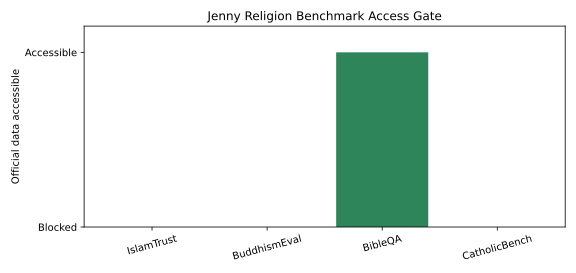
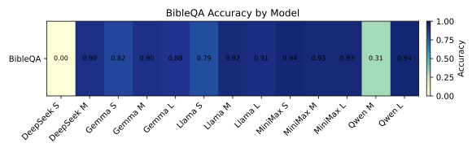
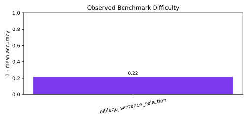
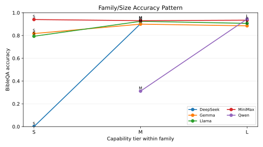

# Jenny Religious Values Benchmark Suite

[](https://github.com/hanzhenzhujene/religious-values-benchmark-jenny/actions/workflows/ci.yml)

This repository is Jenny Zhu's public release workspace for her assigned CEI religious-values benchmark harness runs.

> Project cost: TBD. Cost breakdown: TBD.

## TL;DR

- Snapshot `jenny-religion-20260510` is owned by Jenny Zhu and dated 2026-05-11.
- Comparable completed cells with numeric accuracy: 15; total Done status cells: 15.
- Blocked/queued/TBD cells remain clearly labeled: 45.
- Best current comparable cell: Qwen-L on BibleQA at 0.945.
- Project cost snapshot: TBD.
- 4 benchmarks × 5 model families × 3 size slots = 60 cells; BibleQA is the only runnable benchmark; IslamTrust, CatholicBench, and BuddhismEval are blocked pending data access
- Hardest measured benchmark: BibleQA has mean accuracy 0.845 and spread 0.945; Qwen-L is best at 0.945 and DeepSeek-S is lowest at 0.000.
- Scaling anomaly: MiniMax-S on BibleQA scores 0.940 while MiniMax-M scores 0.930 and MiniMax-L scores 0.934, so this family is non-monotonic in the current snapshot.
- Blocked benchmark count: IslamTrust, CatholicBench, and BuddhismEval account for 45 blocked cells, so only BibleQA contributes comparable accuracy numbers.

## Research Goal

This repo asks how the shared CEI model matrix behaves on Jenny's assigned religious-values benchmark suite when the scoring source is official test or evaluation data. The release contract is deliberately conservative: benchmark-faithful accuracy is reported only where the official artifact is runnable, while blocked or unavailable benchmarks remain labeled as blocked instead of being filled with proxies.

## Benchmark Assignment

| ID | Benchmark | Task | Modality | Data Status | Note |
| --- | --- | --- | --- | --- | --- |
| #35 | IslamTrust | `islamtrust_mc1` | Arabic/English multiple choice | Fully Blocked | HF access requested; no response yet. |
| #47 | CatholicBench | `catholicbench_official` | Scenario plus automated-judge rubric | Fully Blocked | Requires author access or an official export; public dashboard content is not scraped. |
| #26 | BuddhismEval | `buddhism_eval_mcq` | English/Sinhala official eval MCQ | Fully Blocked | Official dataset is inaccessible without permission; Jenny will request author access. |
| #37 | BibleQA | `bibleqa_sentence_selection` | Candidate sentence selection | Done | Official GitHub artifact `bible_qa_list_3_web.json` scored across all 15 model lines. |

Strict data policy: this release uses official test/eval data only. If official data is gated, private, or unavailable, the benchmark is marked Blocked and no public scrape, synthetic substitute, train split, or proxy dataset is treated as the official result.

## Method Overview

1. Register Jenny's four assigned benchmarks and require an official test/eval source before a score can enter the comparable matrix.
2. Route Qwen, DeepSeek, Llama, and Gemma through OpenRouter, and route MiniMax through the direct MiniMax API, using the same S/M/L planning slots as the moral-psychology sweep.
3. Score BibleQA as exact sentence-selection accuracy on the official candidate-selection artifact, with temperature 0 and bounded answer parsing.
4. Preserve blocked statuses for IslamTrust, CatholicBench, and BuddhismEval until Jenny receives the official access or export needed to run them.
5. Build public CSVs and SVGs from authoritative source snapshots so release artifacts can be regenerated without making new model calls.

## Benchmark Result Visuals

The release is visual-first: each figure separates what was actually scored from what remains blocked by official-data access.

[](figures/release/rel_family_size_progress_overview.svg)
*[Caption: Each line has BibleQA complete and the three gated benchmarks blocked, so progress is real but narrow.]*

[](figures/release/rel_benchmark_accuracy_bars.svg)
*[Caption: Only BibleQA has comparable numeric accuracy; blocked benchmarks stay visible as n/a rather than being backfilled.]*

[](figures/release/rel_accuracy_heatmap.svg)
*[Caption: The heatmap makes the current comparable evidence clear: one runnable benchmark, fifteen model lines, and no proxy scores.]*

[](figures/release/rel_benchmark_difficulty_profile.svg)
*[Caption: BibleQA is the only benchmark with a difficulty estimate in this snapshot; the spread is large across model lines.]*

[](figures/release/rel_family_scaling_profile.svg)
*[Caption: The single-benchmark scaling view shows several non-monotonic patterns, so it should be read cautiously.]*

[](figures/release/rel_coverage_matrix.svg)
*[Caption: The coverage grid separates completed BibleQA cells from official-data blocks for IslamTrust, CatholicBench, and BuddhismEval.]*

[](figures/release/jenny_religion_access_gate.svg)
*[Caption: Earlier access-gate view retained with the release artifacts; use the current coverage matrix for the authoritative status grid.]*

[](figures/release/jenny_religion_accuracy_heatmap.svg)
*[Caption: Earlier heatmap view retained with the release artifacts; use the current rel_accuracy_heatmap.svg for this snapshot.]*

[](figures/release/jenny_religion_benchmark_difficulty.svg)
*[Caption: Earlier benchmark-difficulty view retained with the release artifacts; use the current difficulty profile for this snapshot.]*

[](figures/release/jenny_religion_family_size.svg)
*[Caption: Earlier family-size view retained with the release artifacts; use the current progress overview for this snapshot.]*

## Public Quickstart

| Goal | Command | Requires secrets? |
| --- | --- | --- |
| Verify deliverable | `make bootstrap` | No |
| Live smoke test | `make smoke` | Yes |

## Navigate This Repo

| If you want to... | Start here |
| --- | --- |
| Inspect the public release outputs | [results/release/jenny-religion/](results/release/jenny-religion/) |
| Understand official-data access gates | [docs/data-access.md](docs/data-access.md) |
| Reproduce setup, smoke, full, and rebound runs | [docs/reproducibility.md](docs/reproducibility.md) |
| Read the comparable accuracy table | [benchmark-comparison.csv](results/release/jenny-religion/benchmark-comparison.csv) |
| Read the family-size progress matrix | [family-size-progress.csv](results/release/jenny-religion/family-size-progress.csv) |
| Jump to the visual overview | [Benchmark Result Visuals](#benchmark-result-visuals) |
| Read the implementation/run plan | [PLAN.md](PLAN.md) |

## Repository Layout

```text
.github/                                  # Repository templates, ownership metadata, and CI workflow
data/                                     # Official-data manifests and local mirror slots
docs/                                     # Data-access and reproducibility notes
figures/release/                          # Public SVG figures generated from release snapshots
results/release/jenny-religion/           # Public CSVs, README data blocks, and source snapshots
results/inspect/                          # Inspect logs, full-run outputs, and rebound provenance
scripts/                                  # Dataset checks, runner shell, rebound planner, and release builder
src/inspect/                              # Inspect task builders and scoring utilities
tests/                                    # Unit and integration tests for tasks, scoring, and artifacts
Makefile                                  # Local setup, smoke, release, bootstrap, and rebound entrypoints
pyproject.toml                            # Python package and uv workspace configuration
```

## Models

Small, Medium, and Large are planning slots inside each model family, not vendor taxonomy or raw parameter-count claims.

| Family | Small slot | Medium slot | Large slot | Coverage |
| --- | --- | --- | --- | --- |
| Qwen | `qwen/qwen3-8b` | `qwen/qwen3-32b` | `qwen/qwen3-235b-a22b` | BibleQA parsed; other assigned benchmarks blocked pending official data access |
| MiniMax | `minimax/minimax-01` | `minimax/minimax-m1` | `minimax/minimax-m2.5` | BibleQA parsed; other assigned benchmarks blocked pending official data access |
| DeepSeek | `deepseek/deepseek-r1-distill-llama-70b` | `deepseek/deepseek-chat-v3.1` | `deepseek/deepseek-r1` | BibleQA parsed; other assigned benchmarks blocked pending official data access |
| Llama | `meta-llama/llama-3.2-3b-instruct` | `meta-llama/llama-3.1-8b-instruct` | `meta-llama/llama-3.3-70b-instruct` | BibleQA parsed; other assigned benchmarks blocked pending official data access |
| Gemma | `google/gemma-3-4b-it` | `google/gemma-3-12b-it` | `google/gemma-3-27b-it` | BibleQA parsed; other assigned benchmarks blocked pending official data access |

## Data Flow

```text
Benchmark inputs
  -> Task builders (src/inspect/evals/)
  -> Runner (scripts/)
  -> OpenRouter / MiniMax
  -> Inspect outputs (results/inspect/)
  -> Release builder (scripts/build_release_artifacts.py)
  -> Public outputs (figures/ + results/release/)
```

## Results First

| Line | Scope | Status | Coverage | Note |
| --- | --- | --- | --- | --- |
| Qwen-S | Assigned Jenny matrix | Partial | 1 benchmark complete | BibleQA Done; IslamTrust, CatholicBench, and BuddhismEval remain Blocked. |
| Qwen-M | Assigned Jenny matrix | Partial | 1 benchmark complete | BibleQA Done; IslamTrust, CatholicBench, and BuddhismEval remain Blocked. |
| Qwen-L | Assigned Jenny matrix | Partial | 1 benchmark complete | BibleQA Done; IslamTrust, CatholicBench, and BuddhismEval remain Blocked. |
| MiniMax-S | Assigned Jenny matrix | Partial | 1 benchmark complete | BibleQA Done; IslamTrust, CatholicBench, and BuddhismEval remain Blocked. |
| MiniMax-M | Assigned Jenny matrix | Partial | 1 benchmark complete | BibleQA Done; IslamTrust, CatholicBench, and BuddhismEval remain Blocked. |
| MiniMax-L | Assigned Jenny matrix | Partial | 1 benchmark complete | BibleQA Done; IslamTrust, CatholicBench, and BuddhismEval remain Blocked. |
| DeepSeek-S | Assigned Jenny matrix | Partial | 1 benchmark complete | BibleQA Done; IslamTrust, CatholicBench, and BuddhismEval remain Blocked. |
| DeepSeek-M | Assigned Jenny matrix | Partial | 1 benchmark complete | BibleQA Done; IslamTrust, CatholicBench, and BuddhismEval remain Blocked. |
| DeepSeek-L | Assigned Jenny matrix | Partial | 1 benchmark complete | BibleQA Done; IslamTrust, CatholicBench, and BuddhismEval remain Blocked. |
| Llama-S | Assigned Jenny matrix | Partial | 1 benchmark complete | BibleQA Done; IslamTrust, CatholicBench, and BuddhismEval remain Blocked. |
| Llama-M | Assigned Jenny matrix | Partial | 1 benchmark complete | BibleQA Done; IslamTrust, CatholicBench, and BuddhismEval remain Blocked. |
| Llama-L | Assigned Jenny matrix | Partial | 1 benchmark complete | BibleQA Done; IslamTrust, CatholicBench, and BuddhismEval remain Blocked. |
| Gemma-S | Assigned Jenny matrix | Partial | 1 benchmark complete | BibleQA Done; IslamTrust, CatholicBench, and BuddhismEval remain Blocked. |
| Gemma-M | Assigned Jenny matrix | Partial | 1 benchmark complete | BibleQA Done; IslamTrust, CatholicBench, and BuddhismEval remain Blocked. |
| Gemma-L | Assigned Jenny matrix | Partial | 1 benchmark complete | BibleQA Done; IslamTrust, CatholicBench, and BuddhismEval remain Blocked. |

[](figures/release/rel_family_size_progress_overview.svg)
*[Caption: The matrix is partially complete by line because BibleQA is done while the other three benchmarks are blocked pending official access.]*

## Current Comparable Accuracy Snapshot

Metric definition version: 2026-05-11.

| Line | IslamTrust | CatholicBench | BuddhismEval | BibleQA | Comparison note |
| --- | --- | --- | --- | --- | --- |
| Qwen-S | n/a | n/a | n/a | 0.9287 | BibleQA complete; three official-data gates blocked. |
| Qwen-M | n/a | n/a | n/a | 0.9266 | BibleQA complete; slight dip from Qwen-S on this benchmark. |
| Qwen-L | n/a | n/a | n/a | 0.9447 | Highest BibleQA score in the current snapshot. |
| MiniMax-S | n/a | n/a | n/a | 0.9402 | Strong BibleQA score through MiniMax API. |
| MiniMax-M | n/a | n/a | n/a | 0.9300 | BibleQA complete; below MiniMax-S in this snapshot. |
| MiniMax-L | n/a | n/a | n/a | 0.9345 | BibleQA complete; below MiniMax-S and above MiniMax-M. |
| DeepSeek-S | n/a | n/a | n/a | 0.0000 | BibleQA complete with the lowest recorded value. |
| DeepSeek-M | n/a | n/a | n/a | 0.9029 | BibleQA complete; large jump over DeepSeek-S. |
| DeepSeek-L | n/a | n/a | n/a | 0.9443 | BibleQA complete; essentially tied with the top line. |
| Llama-S | n/a | n/a | n/a | 0.7935 | BibleQA complete; lower than Llama-M and Llama-L. |
| Llama-M | n/a | n/a | n/a | 0.9244 | BibleQA complete; highest Llama slot in this snapshot. |
| Llama-L | n/a | n/a | n/a | 0.9063 | BibleQA complete; below Llama-M on this benchmark. |
| Gemma-S | n/a | n/a | n/a | 0.8172 | BibleQA complete; lower than Gemma-M and Gemma-L. |
| Gemma-M | n/a | n/a | n/a | 0.8995 | BibleQA complete; highest Gemma slot in this snapshot. |
| Gemma-L | n/a | n/a | n/a | 0.8849 | BibleQA complete; below Gemma-M on this benchmark. |

BibleQA is the only comparable-accuracy benchmark in this snapshot because it has an official runnable artifact and completed model-line scores. IslamTrust, CatholicBench, and BuddhismEval are not proxy-only rows here; they are blocked rows, so their cells remain n/a until official data access or an official export is available.

## Interpretation

### At a Glance

| Claim | Evidence | Why it matters |
| --- | --- | --- |
| Strongest comparable line | Qwen-L on BibleQA scores 0.9447; DeepSeek-L is close at 0.9443. | The top two BibleQA cells are nearly tied, so the current leader should be read as snapshot-specific rather than definitive. |
| Hardest benchmark | BibleQA is the only measured benchmark and has mean 0.8452 with spread 0.9447. | The large spread shows model-line differences, but blocked benchmarks prevent a cross-benchmark difficulty ranking. |
| Closest-to-saturation benchmark | BibleQA has a top score of 0.9447 and three lines at or above 0.9400. | The best systems are close on this candidate-selection task, while weaker or misaligned output behavior still matters. |
| Scaling-law read | Qwen, MiniMax, Llama, and Gemma are non-monotonic on BibleQA; DeepSeek rises from 0.0000 to 0.9029 to 0.9443. | One benchmark is insufficient for a family-wide scaling claim. |

### Benchmark Reading Guide

| Benchmark | What the paper tests | What this repo scores | How to read the result |
| --- | --- | --- | --- |
| IslamTrust | Islamic trust and religion-sensitive multiple-choice behavior in Arabic and English. | Not yet run | Blocked means no official HF access yet; there is no comparable number. |
| CatholicBench | Catholic doctrine, moral, and pastoral scenario reasoning through an automated judge. | Not yet run | Blocked means no official scenario/rubric export has been received. |
| BuddhismEval | Buddhist knowledge/value MCQ evaluation in official English and Sinhala eval subsets. | Not yet run | Blocked means the official dataset candidate is inaccessible without permission. |
| BibleQA | Selection of the correct Bible sentence or passage candidate for a question. | Exact sentence-selection accuracy | Higher values mean the model selected the official correct candidate more often. |

### Benchmark Difficulty Profile

[](figures/release/rel_benchmark_difficulty_profile.svg)
*[Caption: Difficulty is currently measurable only for BibleQA; blocked benchmarks are omitted from the numeric difficulty table.]*

| Benchmark | Mean accuracy | Best line | Worst line | Spread | Reading |
| --- | --- | --- | --- | --- | --- |
| BibleQA | 0.8452 | Qwen-L (0.9447) | DeepSeek-S (0.0000) | 0.9447 | Wide spread across lines, with the top cells near 0.945 and the lowest cell at 0.0000. |

### Family Scaling Profile

[](figures/release/rel_family_scaling_profile.svg)
*[Caption: Family scaling is shown only for BibleQA, so non-monotonic lines are diagnostic rather than conclusive.]*

| Family | Evidence scope | Numeric pattern | Cautious interpretation |
| --- | --- | --- | --- |
| Qwen | BibleQA only, 3 size slots | S 0.9287 -> M 0.9266 -> L 0.9447 | Non-monotonic on BibleQA; the slot labels are planning slots, not a settled scaling law. |
| MiniMax | BibleQA only, 3 size slots | S 0.9402 -> M 0.9300 -> L 0.9345 | Non-monotonic on BibleQA; the slot labels are planning slots, not a settled scaling law. |
| DeepSeek | BibleQA only, 3 size slots | S 0.0000 -> M 0.9029 -> L 0.9443 | Monotonic on BibleQA only; do not generalize beyond one benchmark. |
| Llama | BibleQA only, 3 size slots | S 0.7935 -> M 0.9244 -> L 0.9063 | Non-monotonic on BibleQA; the slot labels are planning slots, not a settled scaling law. |
| Gemma | BibleQA only, 3 size slots | S 0.8172 -> M 0.8995 -> L 0.8849 | Non-monotonic on BibleQA; the slot labels are planning slots, not a settled scaling law. |

## Status Key

| Mark | Meaning |
| --- | --- |
| Done | Official data was scored and a release artifact records the cell. |
| Blocked | Official data, access, or author export is unavailable; no proxy is substituted. |
| Partial | Some cells in the row are complete and others are blocked, missing, or incomplete. |
| Error | A run was attempted but failed. |
| Queue | The run is queued and has not produced a score. |
| TBD | The cell is planned but has not yet been attempted. |

## Family-Size Progress Matrix

| Line | IslamTrust | CatholicBench | BuddhismEval | BibleQA | Note |
| --- | --- | --- | --- | --- | --- |
| Qwen-S | Blocked | Blocked | Blocked | Done | 1 Done, 3 Blocked |
| Qwen-M | Blocked | Blocked | Blocked | Done | 1 Done, 3 Blocked |
| Qwen-L | Blocked | Blocked | Blocked | Done | 1 Done, 3 Blocked |
| MiniMax-S | Blocked | Blocked | Blocked | Done | 1 Done, 3 Blocked |
| MiniMax-M | Blocked | Blocked | Blocked | Done | 1 Done, 3 Blocked |
| MiniMax-L | Blocked | Blocked | Blocked | Done | 1 Done, 3 Blocked |
| DeepSeek-S | Blocked | Blocked | Blocked | Done | 1 Done, 3 Blocked |
| DeepSeek-M | Blocked | Blocked | Blocked | Done | 1 Done, 3 Blocked |
| DeepSeek-L | Blocked | Blocked | Blocked | Done | 1 Done, 3 Blocked |
| Llama-S | Blocked | Blocked | Blocked | Done | 1 Done, 3 Blocked |
| Llama-M | Blocked | Blocked | Blocked | Done | 1 Done, 3 Blocked |
| Llama-L | Blocked | Blocked | Blocked | Done | 1 Done, 3 Blocked |
| Gemma-S | Blocked | Blocked | Blocked | Done | 1 Done, 3 Blocked |
| Gemma-M | Blocked | Blocked | Blocked | Done | 1 Done, 3 Blocked |
| Gemma-L | Blocked | Blocked | Blocked | Done | 1 Done, 3 Blocked |

The same matrix is saved as [family-size-progress.csv](results/release/jenny-religion/family-size-progress.csv).

## The Four Benchmark Papers

| Benchmark | Paper | Dataset/access | Modality | What this repo tests now |
| --- | --- | --- | --- | --- |
| IslamTrust | [IslamTrust benchmark source](https://github.com/aii-lab-dot-org/IslamTrust) | [HF gated dataset card](https://huggingface.co/datasets/Abderraouf000/IslamTrust-benchmark) | Arabic/English MC1 | Not yet run; HF access requested and pending. |
| CatholicBench | [CatholicBench public dashboard](https://catholicbench.com/) | Author access or official export required | Scenario/rubric evaluation | Not yet run; no official downloadable dataset or API is available. |
| BuddhismEval | [BuddhismEval official dataset candidate](https://huggingface.co/datasets/Nethmi14/BuddhismEval) | Official dataset access required | English/Sinhala MCQ eval subsets | Not yet run; permission required. |
| BibleQA | [BibleQA paper: arXiv:1810.12118](https://arxiv.org/abs/1810.12118) | [Official GitHub artifact](https://github.com/helen-jiahe-zhao/BibleQA) | Candidate sentence selection | Scored with exact sentence-selection accuracy on `bible_qa_list_3_web.json`. |

## Supporting Figures

| Figure | Why it matters | File |
| --- | --- | --- |
| jenny_religion_access_gate.svg | Legacy access-gate figure retained from the earlier release package. | [jenny_religion_access_gate.svg](figures/release/jenny_religion_access_gate.svg) |
| jenny_religion_accuracy_heatmap.svg | Legacy heatmap retained from the earlier release package. | [jenny_religion_accuracy_heatmap.svg](figures/release/jenny_religion_accuracy_heatmap.svg) |
| jenny_religion_benchmark_difficulty.svg | Legacy difficulty figure retained from the earlier release package. | [jenny_religion_benchmark_difficulty.svg](figures/release/jenny_religion_benchmark_difficulty.svg) |
| jenny_religion_family_size.svg | Legacy family-size figure retained from the earlier release package. | [jenny_religion_family_size.svg](figures/release/jenny_religion_family_size.svg) |
| rel_accuracy_heatmap.svg | Makes the BibleQA-only numeric coverage visible at a glance. | [rel_accuracy_heatmap.svg](figures/release/rel_accuracy_heatmap.svg) |
| rel_benchmark_accuracy_bars.svg | Shows comparable accuracy where it exists and n/a where official data is blocked. | [rel_benchmark_accuracy_bars.svg](figures/release/rel_benchmark_accuracy_bars.svg) |
| rel_benchmark_difficulty_profile.svg | Summarizes benchmark-level mean, best, worst, and spread for runnable benchmarks. | [rel_benchmark_difficulty_profile.svg](figures/release/rel_benchmark_difficulty_profile.svg) |
| rel_coverage_matrix.svg | Separates Done and Blocked cells in the public matrix. | [rel_coverage_matrix.svg](figures/release/rel_coverage_matrix.svg) |
| rel_family_scaling_profile.svg | Displays size-slot patterns by family on the runnable benchmark. | [rel_family_scaling_profile.svg](figures/release/rel_family_scaling_profile.svg) |
| rel_family_size_progress_overview.svg | Shows completed versus blocked status across all line-benchmark cells. | [rel_family_size_progress_overview.svg](figures/release/rel_family_size_progress_overview.svg) |

[](figures/release/rel_accuracy_heatmap.svg)
*[Caption: Blank or hatched cells are n/a because official data is blocked, not because a model was assigned a zero.]*

[](figures/release/rel_coverage_matrix.svg)
*[Caption: The coverage matrix is the quickest check of what was run versus what is blocked by data access.]*

## Reproducibility

### Public verification path

```bash
make bootstrap
```

This rebuilds the public release artifacts from committed source snapshots and does not require API keys.

### Live benchmark smoke test

```bash
make setup && cp .env.example .env && make smoke
```

Live smoke runs need `OPENROUTER_API_KEY` for OpenRouter-backed families and `MINIMAX_API_KEY` for MiniMax. Benchmark-specific official data access uses `HF_TOKEN` or `HUGGING_FACE_HUB_TOKEN`, plus optional official local export paths such as `BIBLEQA_DATA_FILE`, `ISLAMTRUST_DATA_FILE`, `BUDDHISM_EVAL_DATA_FILE`, and `CATHOLICBENCH_DATA_FILE`.

### Rebuild the public package

```bash
make release
```

Expected CSV outputs: `benchmark-comparison.csv`, `family-size-progress.csv`, `benchmark-difficulty-summary.csv`, and `family-scaling-summary.csv`. Expected SVG outputs: `rel_family_size_progress_overview.svg`, `rel_benchmark_accuracy_bars.svg`, `rel_accuracy_heatmap.svg`, `rel_benchmark_difficulty_profile.svg`, `rel_family_scaling_profile.svg`, and `rel_coverage_matrix.svg`.

## Citation

Repository citation metadata is in [CITATION.cff](CITATION.cff). Benchmark-specific sources and access links are listed in [The Four Benchmark Papers](#the-four-benchmark-papers).

## Snapshot

| Field | Value |
| --- | --- |
| Report owner | Jenny Zhu |
| Repo update date | 2026-05-11 |
| Release snapshot | jenny-religion-20260510 |
| Project cost | TBD |
| Cost breakdown | TBD |
| Cost scope | Current source snapshot records cost as TBD; cost is not used as a scoring metric. |
| Intended use | Public release snapshot for Jenny's assigned religious-values benchmark harness. |
| Matrix description | 4 benchmarks × 5 model families × 3 size slots = 60 cells; BibleQA is the only runnable benchmark; IslamTrust, CatholicBench, and BuddhismEval are blocked pending data access |
| Benchmarks in scope | IslamTrust, CatholicBench, BuddhismEval, BibleQA |
| Model families in scope | Qwen, MiniMax, DeepSeek, Llama, Gemma |
| Blocked benchmarks | IslamTrust, CatholicBench, BuddhismEval |
| Run setting | Official test/eval data only; temperature 0; OpenRouter for Qwen, DeepSeek, Llama, and Gemma; MiniMax API for MiniMax. |

## Important Notes

- Blocked benchmark policy: a blocked cell means the official dataset or export is unavailable; it is not an invitation to scrape or reconstruct the benchmark.
- Proxy versus accurate distinction: this snapshot reports no proxy-only accuracy numbers, and comparable accuracy currently comes only from BibleQA.
- How to read n/a cells: n/a means no official comparable score exists for that cell in this release snapshot.
- Scaling-law caution: family size slots are planning labels, and one runnable benchmark is not enough to infer a general scaling law.
- BibleQA is a candidate-selection task, so strong scores there should not be generalized to doctrine, pastoral reasoning, or cross-tradition value alignment without the blocked benchmarks running.
