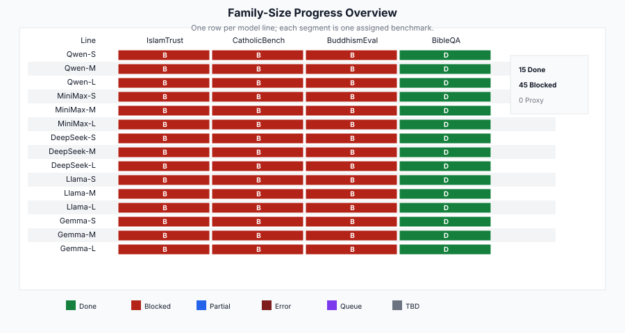
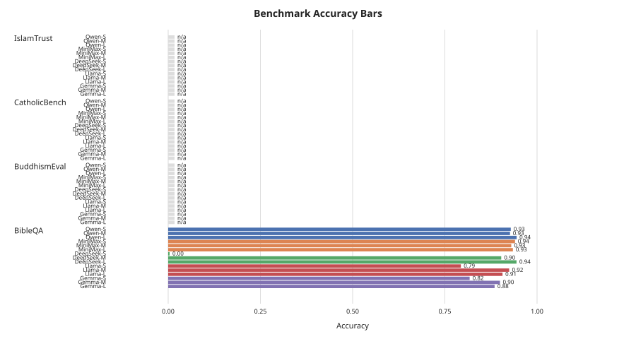
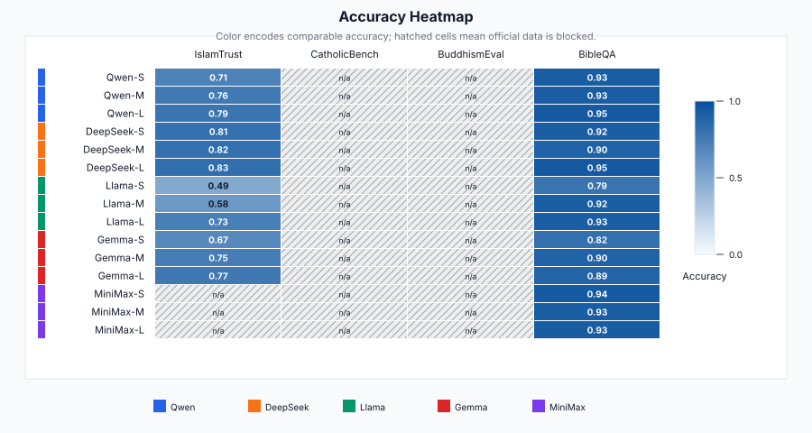
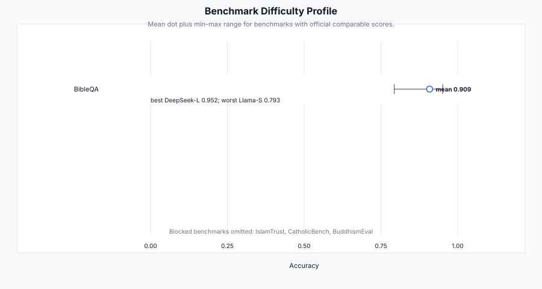
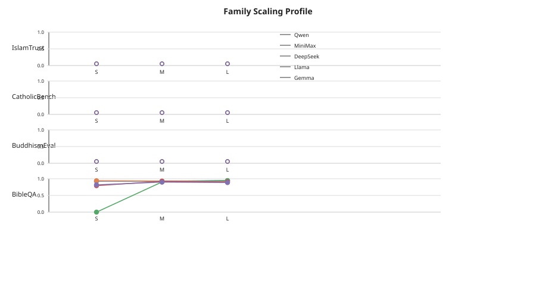
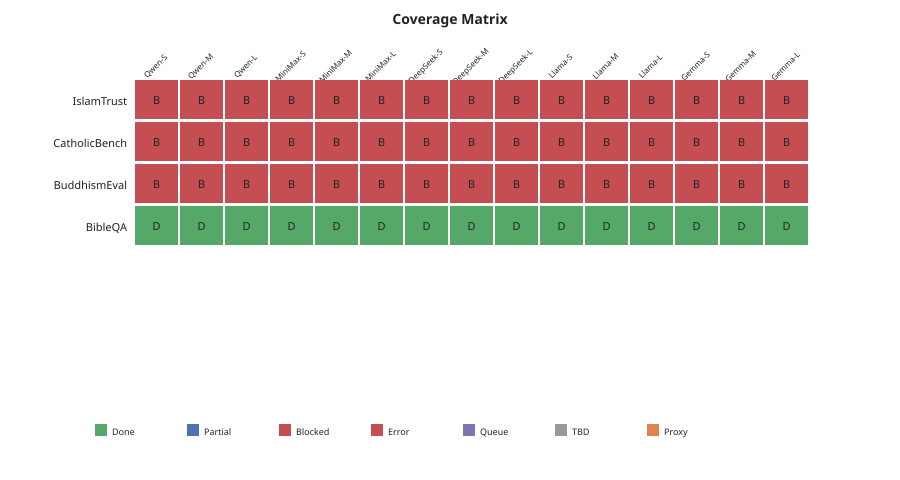

# Jenny Religious Values Benchmark Suite

[](https://github.com/hanzhenzhujene/religious-values-benchmark-jenny/actions/workflows/ci.yml)

Jenny Zhu's public release workspace for her assigned CEI religious-values benchmark harness runs.

> Project cost: TBD. Cost breakdown: TBD.

## TL;DR

- IslamTrust is complete for the 12 OpenRouter model lines on the official gated Hugging Face English+Arabic splits; the best IslamTrust cell is DeepSeek-L at 0.8313.
- BibleQA remains complete for all 15 model lines; the best BibleQA cell is DeepSeek-L at 0.9515.
- IslamTrust is the harder measured benchmark in this snapshot: mean 0.7246 with a 0.3461 spread, from Llama-S at 0.4852 to DeepSeek-L at 0.8313.
- MiniMax was intentionally not run on IslamTrust in this OpenRouter-only sweep, so the three MiniMax IslamTrust cells are marked TBD rather than blocked or failed.
- CatholicBench and BuddhismEval remain blocked under the official-data policy: no author export or accessible official eval split has been received.
- DeepSeek-R1 required targeted 2048-token hard batches; IslamTrust scoring now accepts exact duplicate option aliases as equivalent correct choices.

## Results

Metric definition version: 2026-05-13. IslamTrust is scored as prompted MC1 exact-choice accuracy on official English+Arabic rows with deterministic option shuffling. BibleQA is scored as exact candidate sentence-selection accuracy on the official `bible_qa_list_3_web.json` artifact.

| Line | IslamTrust | CatholicBench | BuddhismEval | BibleQA | Note |
| --- | ---: | --- | --- | ---: | --- |
| Qwen-S | 0.7118 | n/a | n/a | 0.9278 | IslamTrust + BibleQA complete. |
| Qwen-M | 0.7635 | n/a | n/a | 0.9266 | IslamTrust + BibleQA complete. |
| Qwen-L | 0.7906 | n/a | n/a | 0.9458 | Strong Qwen slot on both measured tasks. |
| DeepSeek-S | 0.8128 | n/a | n/a | 0.9210 | IslamTrust timeout samples recovered by targeted rebounds. |
| DeepSeek-M | 0.8153 | n/a | n/a | 0.9029 | Best mid-size IslamTrust line. |
| DeepSeek-L | 0.8313 | n/a | n/a | 0.9515 | Best measured line on both IslamTrust and BibleQA. |
| Llama-S | 0.4852 | n/a | n/a | 0.7935 | Lowest measured line on both tasks. |
| Llama-M | 0.5788 | n/a | n/a | 0.9244 | BibleQA strong; IslamTrust weaker. |
| Llama-L | 0.7315 | n/a | n/a | 0.9289 | Clear IslamTrust scaling within Llama. |
| Gemma-S | 0.6687 | n/a | n/a | 0.8172 | IslamTrust + BibleQA complete. |
| Gemma-M | 0.7463 | n/a | n/a | 0.8995 | Best Gemma slot on BibleQA. |
| Gemma-L | 0.7685 | n/a | n/a | 0.8860 | Best Gemma slot on IslamTrust. |
| MiniMax-S | TBD | n/a | n/a | 0.9402 | IslamTrust not run by request. |
| MiniMax-M | TBD | n/a | n/a | 0.9300 | IslamTrust not run by request. |
| MiniMax-L | TBD | n/a | n/a | 0.9345 | IslamTrust not run by request. |

Machine-readable results are in [benchmark-comparison.csv](results/release/jenny-religion/benchmark-comparison.csv), [result-summary.csv](results/release/jenny-religion/result-summary.csv), [islamtrust-language-breakdown.csv](results/release/jenny-religion/islamtrust-language-breakdown.csv), and [islamtrust-category-breakdown.csv](results/release/jenny-religion/islamtrust-category-breakdown.csv).

## Visual Summary

[](figures/release/rel_family_size_progress_overview.svg)
*[Caption: Done, blocked, and TBD cells across Jenny's four assigned benchmarks.]*

[](figures/release/rel_benchmark_accuracy_bars.svg)
*[Caption: Comparable accuracy is now available for IslamTrust and BibleQA; MiniMax IslamTrust remains n/a/TBD.]*

[](figures/release/rel_accuracy_heatmap.svg)
*[Caption: Darker cells indicate higher comparable accuracy; hatched cells are blocked or not yet run.]*

[](figures/release/rel_benchmark_difficulty_profile.svg)
*[Caption: IslamTrust has the lower mean and wider spread, so it is currently the harder measured benchmark.]*

[](figures/release/rel_family_scaling_profile.svg)
*[Caption: Size-slot curves are shown separately for each measured benchmark and should be read as task-specific.]*

[](figures/release/rel_coverage_matrix.svg)
*[Caption: Coverage separates completed measured cells from blocked official-data cells and MiniMax IslamTrust TBD cells.]*

## Model Matrix

Small, Medium, and Large are planning slots inherited from the shared CEI model matrix. They are not vendor taxonomy labels and do not always correspond to raw parameter count.

| Family | Small slot | Medium slot | Large slot | Route |
| --- | --- | --- | --- | --- |
| Qwen | `qwen/qwen3-8b` | `qwen/qwen3-32b` | `qwen/qwen3-235b-a22b` | OpenRouter |
| DeepSeek | `deepseek/deepseek-r1-distill-llama-70b` | `deepseek/deepseek-chat-v3.1` | `deepseek/deepseek-r1` | OpenRouter |
| Llama | `meta-llama/llama-3.2-3b-instruct` | `meta-llama/llama-3.1-8b-instruct` | `meta-llama/llama-3.3-70b-instruct` | OpenRouter |
| Gemma | `google/gemma-3-4b-it` | `google/gemma-3-12b-it` | `google/gemma-3-27b-it` | OpenRouter |
| MiniMax | `minimax/minimax-01` | `minimax/minimax-m1` | `minimax/minimax-m2.5` | MiniMax API |

## Benchmark Status

| ID | Benchmark | Harness task | Data status | What is reported now |
| --- | --- | --- | --- | --- |
| #35 | IslamTrust | `islamtrust_mc1` | Done for OpenRouter; MiniMax TBD | Prompted MC1 accuracy on official English+Arabic rows. |
| #47 | CatholicBench | `catholicbench_official` | Blocked | Requires author access or official export; public dashboard is not scraped. |
| #26 | BuddhismEval | `buddhism_eval_mcq` | Blocked | Official dataset inaccessible; permission required. |
| #37 | BibleQA | `bibleqa_sentence_selection` | Done | Exact sentence-selection accuracy across all 15 model lines. |

Strict data policy: this release uses official test/eval data only. If official data is gated, private, or unavailable, the benchmark is marked Blocked and no public scrape, synthetic substitute, train split, or proxy dataset is treated as the official result.

## Method

1. Build each benchmark as an Inspect task only when an official source is available.
2. Run temperature 0 with bounded multiple-choice parsing.
3. Route Qwen, DeepSeek, Llama, and Gemma through OpenRouter; route MiniMax through MiniMax only when MiniMax is in scope.
4. For IslamTrust, deterministically shuffle answer choices to reduce position bias and count exact duplicate correct-option text as equivalent.
5. Recover provider failures with targeted sample-ID rebounds, not full reruns, unless a full rerun is necessary.

## Reproducibility

| Goal | Command | Requires secrets? |
| --- | --- | --- |
| Rebuild public CSVs and SVGs | `make bootstrap` | No |
| Run unit/task tests | `make test` | No |
| Check official data access | `make access` | HF login or token for gated datasets |
| Live smoke test | `make setup && cp .env.example .env && make smoke` | Yes |

Live smoke runs need `OPENROUTER_API_KEY` for OpenRouter-backed families and `MINIMAX_API_KEY` for MiniMax. Gated Hugging Face access can use `HF_TOKEN`, `HUGGING_FACE_HUB_TOKEN`, or a cached `hf auth login` token with `HF_USE_CACHED_TOKEN=1`.

## Repository Map

```text
.github/                                  # CI workflow
data/                                     # Official-data manifests and local mirror slots
docs/                                     # Data-access and reproducibility notes
figures/release/                          # Public SVG figures
results/release/jenny-religion/           # Public CSVs, source snapshots, and release notes
results/inspect/                          # Local Inspect logs and rebound provenance; raw logs are gitignored
scripts/                                  # Dataset checks, runner, rebound planner, release builder
src/inspect/                              # Inspect task builders and scoring utilities
tests/                                    # Unit and task-construction tests
Makefile                                  # Setup, test, smoke, release, bootstrap targets
pyproject.toml                            # Python package and uv workspace configuration
```

## Data Flow

```text
Official benchmark inputs
  -> Inspect task builders (src/inspect/evals/)
  -> Runner scripts
  -> OpenRouter / MiniMax API
  -> Inspect outputs
  -> Source snapshots
  -> scripts/build_release_artifacts.py
  -> Public CSVs and SVG figures
```

## Source Links

| Benchmark | Source/access | What this repo tests now |
| --- | --- | --- |
| IslamTrust | [HF gated dataset card](https://huggingface.co/datasets/Abderraouf000/IslamTrust-benchmark), [source repo](https://github.com/aii-lab-dot-org/IslamTrust) | Prompted MC1 accuracy on official English+Arabic splits. |
| CatholicBench | [Public dashboard](https://catholicbench.com/) | Not yet run; official export required. |
| BuddhismEval | [Official dataset candidate](https://huggingface.co/datasets/Nethmi14/BuddhismEval) | Not yet run; permission required. |
| BibleQA | [arXiv:1810.12118](https://arxiv.org/abs/1810.12118), [official GitHub](https://github.com/helen-jiahe-zhao/BibleQA) | Exact sentence-selection accuracy on `bible_qa_list_3_web.json`. |

## Snapshot

| Field | Value |
| --- | --- |
| Report owner | Jenny Zhu |
| Repo update date | 2026-05-13 |
| Release snapshot | `jenny-religion-20260513-islamtrust-openrouter` |
| Matrix description | 4 benchmarks x 5 model families x 3 size slots = 60 cells |
| Completed comparable cells | 27 |
| Blocked cells | 30 |
| TBD cells | 3 MiniMax IslamTrust cells |
| Best IslamTrust cell | DeepSeek-L, 0.8313 |
| Best BibleQA cell | DeepSeek-L, 0.9515 |
| Cost | TBD |

## Important Notes

- Blocked means official data or author export is unavailable; it is not an invitation to scrape or reconstruct the benchmark.
- TBD means the benchmark is accessible but was not run in the current sweep.
- `n/a` cells are missing official comparable scores, not zero scores.
- IslamTrust prompted MC1 is not the same as the IslamTrust paper's logprob MC1 protocol; this repo reports the harness-compatible prompted result transparently.
- Scaling patterns are task-specific. Two measured benchmarks are not enough for a general scaling-law claim.

## Citation

Repository citation metadata is in [CITATION.cff](CITATION.cff). Benchmark-specific sources are listed in [Source Links](#source-links).
